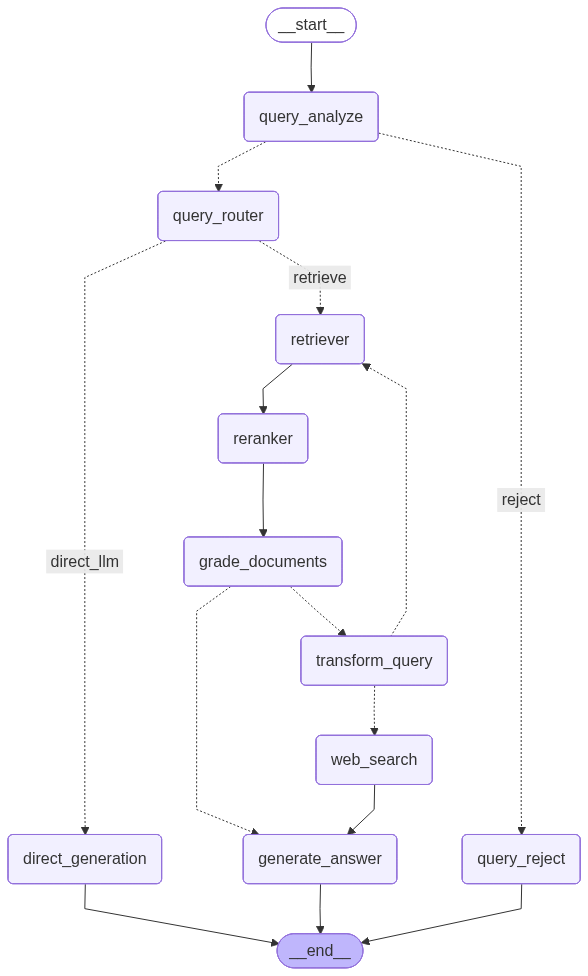

<div align="center">

# 🧠 RAG Document Intelligence Platform

### Production-Grade Adaptive RAG System with Self-Correcting Retrieval

[](https://python.org)
[](https://langchain-ai.github.io/langgraph/)
[](https://qdrant.tech/)
[](https://fastapi.tiangolo.com/)
[](https://streamlit.io/)
[](https://groq.com/)
[](https://smith.langchain.com/)
[](https://docker.com/)
[](https://aws.amazon.com/)

<br/>

> Upload any PDF document. Ask questions in natural language.  
> Get grounded, cited answers — powered by hybrid search, cross-encoder re-ranking, and a self-correcting LangGraph pipeline.

<br/>

[Features](#-key-features) · [Architecture](#-system-architecture) · [Tech Stack](#-tech-stack) · [Quick Start](#-quick-start) · [API Reference](#-api-reference) · [Deployment](#-deployment)

</div>

---

### Demo

## 📋 Overview

A production-grade document intelligence system where users upload PDF documents and ask questions in natural language. The system retrieves the most relevant passages using **Qdrant Cloud hybrid search** (dense BGE vectors + sparse BM42 vectors with native RRF fusion), re-ranks them using a **cross-encoder**, and generates grounded, cited answers using **Groq LLaMA-3.3-70B** — all orchestrated through a **LangGraph** stateful graph with **Corrective RAG (CRAG)** self-correction.

Unlike tutorial chatbots, this is a fully observable, evaluated, and containerised inference service with:
- **Hybrid retrieval** combining semantic understanding and keyword matching in a single Qdrant query
- **Cross-encoder re-ranking** for precision over the top-k results
- **LangGraph orchestration** with self-correcting retrieval (Adaptive RAG + CRAG pattern) — query safety analysis, document grading, query rewriting, retry loops, and web search fallback
- **Adaptive query routing** — intelligent classification into document retrieval vs. direct LLM generation
- **Query safety analysis** — LLM-based detection and rejection of prompt injections and malicious queries
- **Full observability** via LangSmith tracing across every graph node
- **Streamlit UI** with PDF upload, chat interface, and source viewer
- **Docker Compose** deployment with backend + frontend as a single stack
- **Qdrant Cloud** for managed, production-grade vector storage
- **Evaluation** using RAGAS metrics (faithfulness, answer relevance, context recall)

---

## System Architecture

### High Level Design


### CRAG Graph


---

## ✨ Key Features

| Feature | Status | Description |
|---------|--------|-------------|
| 📄 PDF Document Ingestion | ✅ Implemented | Upload PDFs via API or UI → automatic loading, chunking, and dual-vector indexing |
| 🔍 Hybrid Search (Dense + Sparse) | ✅ Implemented | BGE dense embeddings + BM42 sparse vectors with Qdrant-native RRF fusion |
| 🎯 Cross-Encoder Re-Ranking | ✅ Implemented | Jina reranker re-scores (query, chunk) pairs for precision |
| 🤖 LLM Answer Generation | ✅ Implemented | Groq LLaMA-3.3-70B with strict citation and confidence scoring |
| 🔗 LangGraph Pipeline | ✅ Implemented | Stateful graph: Retrieve → Rerank → Generate with typed state |
| 🌐 FastAPI REST Service | ✅ Implemented | `/ingest`, `/retrieve`, `/health`, and `/version` endpoints with auto-generated OpenAPI docs |
| 📊 LangSmith Tracing | ✅ Implemented | Full observability with `@traceable` decorators on retrieval and reranking |
| 🔄 CRAG Self-Correction | ✅ Implemented | Query rewriting, document grading, retry loops, and web search fallback |
| 🌐 Adaptive Query Routing | ✅ Implemented | Intelligent routing — direct retrieval vs. web search based on query analysis |
| 🛡️ Query Safety Analysis | ✅ Implemented | LLM-based detection and rejection of prompt injections and malicious queries |
| 📈 RAGAS Evaluation | ✅ Implemented | Faithfulness, answer relevance, context recall, and context precision scoring |
| 🖥️ Streamlit UI | ✅ Implemented | File upload panel, chat interface, source viewer with expandable citations |
| 🐳 Docker Compose Stack | ✅ Implemented | Backend + Frontend as a single deployable stack with Qdrant Cloud |
| ☁️ Qdrant Cloud | ✅ Implemented | Managed vector database with API key authentication and payload indexing |
| 🚀 AWS EC2 Deployment | ✅ Deployed | Containerised deployment on AWS EC2 |

---

## 🛠️ Tech Stack

| Layer | Technology | Why |
|-------|-----------|-----|
| **Document Loading** | `PyMuPDF` | Fast, reliable PDF text extraction |
| **Text Chunking** | `RecursiveCharacterTextSplitter` | Respects paragraph/sentence boundaries; 1500 chars with 300 overlap |
| **Dense Embeddings** | `BAAI/bge-base-en-v1.5` | Free, strong embeddings that run locally via FastEmbed — zero API cost |
| **Sparse Embeddings** | `Qdrant/bm42-all-minilm-l6-v2-attentions` | BERT-attention-based sparse vectors; semantically aware keyword matching |
| **Vector Database** | `Qdrant Cloud` | Managed service with dense + sparse vectors in one collection; native RRF hybrid fusion |
| **Hybrid Fusion** | `Qdrant built-in RRF` | Single `query_points()` call with `FusionQuery(RRF)` — no custom fusion code |
| **Re-Ranking** | `Jina Reranker v1 Tiny EN` (via `fastembed`) | Cross-encoder re-scoring for precision over bi-encoder retrieval |
| **LLM** | `Groq LLaMA-3.3-70B` | Free API, blazing-fast inference (500+ tok/sec) |
| **Orchestration** | `LangGraph` | Stateful graph with conditional edges — essential for self-correcting RAG |
| **Observability** | `LangSmith` | Traces every graph node — latency, token usage, I/O, graph path |
| **API Backend** | `FastAPI + Uvicorn` | Async, typed, auto-generated OpenAPI documentation |
| **Frontend** | `Streamlit` | PDF upload, chat interface, source viewer |
| **Evaluation** | `RAGAS` | Faithfulness, answer relevance, context recall, context precision |
| **Containerisation** | `Docker + Docker Compose` | Backend + Frontend as a single deployable stack |
| **Cloud** | `AWS EC2` | Production deployment with Docker Compose |

---

## 📁 Project Structure

```
Advanced-RAG-System/
│
├── src/
│   ├── ingestion/
│   │   ├── loader.py              # PyMuPDF document loader
│   │   ├── chunker.py             # Recursive character text splitter (1500 chars, 300 overlap)
│   │   └── embedder.py            # Dense BGE + Sparse BM42 → Qdrant Cloud dual-vector upsert
│   │
│   ├── retriever/
│   │   ├── hybrid_retriever.py    # Qdrant hybrid search (Prefetch + RRF fusion)
│   │   └── reranker.py            # Cross-encoder re-ranking with Jina reranker
│   │
│   ├── graph/
│   │   ├── rag_graph.py           # LangGraph linear pipeline: Retrieve → Rerank → Generate
│   │   └── crag_graph.py          # LangGraph CRAG pipeline: Safety → Route → Retrieve → Rerank → Grade → Transform → Web Search → Generate
│   │
│   └── api/
│       ├── main.py                # FastAPI app — mounts ingest, retrieve & health routers
│       └── router/
│           ├── ingest.py          # POST /ingest — upload, chunk, embed, store
│           ├── retrieve.py        # POST /retrieve — invoke LangGraph CRAG pipeline
│           └── health.py          # GET /health, GET /version — service health checks
│
├── frontend/
│   ├── app.py                     # Streamlit UI — PDF upload, chat, source viewer
│   ├── Dockerfile                 # Frontend container image
│   └── requirements.txt           # streamlit, requests
│
├── notebooks/
│   ├── testing_notebook.ipynb     # Experimentation and component testing
│   ├── crag.ipynb                 # CRAG pipeline development and testing
│   ├── graph_testing.ipynb        # Graph testing and validation
│   └── eval_test.ipynb            # RAGAS evaluation pipeline
│
├── data/
│   ├── raw/                       # Uploaded documents storage
│   └── eval_dataset.json          # Evaluation dataset for RAGAS
│
├── assets/                        # Architecture diagrams and images
├── model_preload.py               # Pre-downloads embedding & reranker models during Docker build
├── Dockerfile                     # Backend container image (Python 3.13-slim)
├── docker-compose.yml             # Multi-service orchestration (backend + frontend)
├── requirements-dev.txt           # Python dependencies (production)
├── .env                           # API keys (GROQ, Qdrant Cloud, LangSmith, Tavily, etc.)
├── .dockerignore                  # Docker build exclusions
├── .dvc/                          # Data version control configuration
├── .gitignore                     # Git exclusions
└── README.md
```

---

## 🚀 Quick Start

### Prerequisites

- [Docker](https://docs.docker.com/get-docker/) & [Docker Compose](https://docs.docker.com/compose/install/)
- API Keys: [Groq](https://console.groq.com), [Qdrant Cloud](https://cloud.qdrant.io), [LangSmith](https://smith.langchain.com), [Tavily](https://tavily.com) *(free tiers available)*

### 1. Clone & Configure

```bash
git clone https://github.com/ankitshri00132/Advanced-RAG-System.git
cd Advanced-RAG-System
```

Create a `.env` file in the project root with the following keys:

```env
# LLM
GROQ_API_KEY=gsk_your_groq_key

# Vector Database (Qdrant Cloud)
QDRANT_URL=https://your-cluster.cloud.qdrant.io
QDRANT_API_KEY=your_qdrant_cloud_api_key

# Web Search Fallback
TAVILY_API_KEY=tvly-your_tavily_key

# Observability
LANGSMITH_TRACING=true
LANGSMITH_ENDPOINT=https://api.smith.langchain.com
LANGSMITH_API_KEY=lsv2_your_langsmith_key
LANGSMITH_PROJECT=Advanced-RAG-System

# Frontend → Backend communication (used inside Docker network)
API_BASE_URL=http://backend:8000
```

### 2. Launch with Docker Compose

```bash
docker compose up --build
```

This will:
1. **Build the backend** — installs dependencies, pre-downloads embedding models (BGE, BM42, Jina Reranker), and starts the FastAPI server on port `8000`
2. **Build the frontend** — installs Streamlit and starts the UI on port `8501`

### 3. Access the Application

| Service | URL | Description |
|---------|-----|-------------|
| **Streamlit UI** | `http://localhost:8501` | Upload PDFs and chat |
| **FastAPI Docs** | `http://localhost:8000/docs` | Interactive API documentation |
| **Health Check** | `http://localhost:8000/health` | Service health status |

### Local Development (without Docker)

```bash
python -m venv .venv
source .venv/bin/activate        # Linux/Mac
# .venv\Scripts\activate         # Windows

pip install -r requirements-dev.txt

# Start backend
uvicorn src.api.main:app --reload --host 0.0.0.0 --port 8000

# Start frontend (in a separate terminal)
cd frontend
pip install -r requirements.txt
streamlit run app.py
```

---

## 📡 API Reference

### `GET /health` — Health Check

```bash
curl http://localhost:8000/health
```

```json
{ "status": "healthy" }
```

### `GET /version` — API Version

```bash
curl http://localhost:8000/version
```

```json
{ "version": "1.0.0" }
```

---

### `POST /ingest` — Upload & Index a Document

Upload a PDF file to be processed through the ingestion pipeline (load → chunk → embed → store).

**Request:**
```bash
curl -X POST http://localhost:8000/ingest \
  -F "file=@annual_report_2024.pdf"
```

**Response:**
```json
{
  "status": "success",
  "document_id": "a3f1c2d4-5e6f-7890-abcd-ef1234567890",
  "pages_loaded": 24,
  "chunks_created": 142,
  "message": "Vectors successfully stored in Qdrant DB"
}
```

---

### `POST /retrieve` — Query the Knowledge Base

Ask a natural language question — the LangGraph CRAG pipeline retrieves, reranks, grades, and generates a grounded answer.

**Request:**
```bash
curl -X POST http://localhost:8000/retrieve \
  -H "Content-Type: application/json" \
  -d '{"query": "What was the net revenue in Q3?", "document_id": "a3f1c2d4-..."}'
```

> **Note:** `document_id` is optional. When provided, retrieval is scoped to that specific document. Without it, the system searches across all ingested documents.

**Response:**
```json
{
  "query": "What was the net revenue in Q3?",
  "answer": "Answer:\nNet revenue in Q3 was $4.2 billion, representing a 12% YoY increase...\n\nCitations:\nPage 14, Page 15",
  "sources": [
    {
      "rank": 1,
      "rerank_score": 0.94,
      "original_score": 0.87,
      "document": "Q3 net revenue reached $4.2B, a 12% YoY increase...",
      "metadata": {
        "document_id": "a3f1c2d4-...",
        "file_name": "annual_report_2024.pdf",
        "page": 14
      }
    }
  ]
}
```

---

## 🔬 How It Works

### 1. Ingestion Pipeline

```
PDF Upload → PyMuPDF Loader → Recursive Chunker (1500 chars, 300 overlap)
                                       │
                   ┌───────────────────┴───────────────────┐
                   │                                       │
           BGE Dense Embedding                    BM42 Sparse Vectors
           (BAAI/bge-base-en-v1.5)    (Qdrant/bm42-all-minilm-l6-v2-attentions)
                   │                                       │
                   └───────────────┬───────────────────────┘
                                   │
                           Qdrant Cloud Collection
                        (dual named vector spaces)
                        + payload index on document_id
```

Each chunk is stored with **both** a dense embedding (for semantic search) and a sparse vector (for keyword matching), along with metadata (document ID, filename, page number, title).

### 2. Hybrid Retrieval + Re-Ranking

```
User Query → Dense + Sparse Encoding → Qdrant Prefetch (10 each)
                                              │
                                     RRF Fusion (built-in)
                                              │
                                     Top-10 Candidates
                                              │
                                  Cross-Encoder Re-Ranking
                                    (Jina Reranker v1)
                                              │
                                       Top-5 Chunks
```

Qdrant's native RRF fusion eliminates the need for custom fusion code. The cross-encoder then re-scores each `(query, chunk)` pair by attending to both together — far more accurate than bi-encoder similarity.

### 3. LangGraph CRAG Pipeline

```
START → Query Safety Analysis
           ├── "safe" → Query Router
           │               ├── "retrieve" → Retrieve → Re-rank → Grade Documents
           │               │                             ├── relevant ✓ → Generate Answer → END
           │               │                             └── not relevant ✗ → Transform Query
           │               │                                                    ├── retry ≤ 2 → Retrieve (loop)
           │               │                                                    └── retry > 2 → Web Search → Generate Answer → END
           │               └── "direct_llm" → Direct Generate → END
           └── "unsafe" → Reject Query → END
```

The CRAG (Corrective RAG) pipeline adds **self-correction** and **safety** to the standard RAG flow:

- **Query Safety Analysis** — an LLM detects prompt injections, attempts to reveal system prompts, and other malicious queries
- **Query Router** — classifies queries as document retrieval or direct LLM (keyword heuristics + structured LLM output)
- **Document Grading** — an LLM evaluates whether retrieved chunks are relevant to the query (lenient grading)
- **Query Transform** — rewrites the query using an LLM when documents are graded as irrelevant, always rewriting from the **original query** to avoid drift
- **Retry Loop** — retries retrieval up to 2 times with rewritten queries before falling back to web search
- **Web Search Fallback** — uses Tavily to fetch live web results when local retrieval fails

The LLM generates a grounded answer with strict citation rules — every response includes:
- **Page numbers** from the source document
- **Source filename** for traceability

---

## 🐳 Docker Architecture

The system runs as a two-service Docker Compose stack:

```
┌─────────────────────────────────────────────────┐
│                 Docker Compose                  │
│                                                 │
│  ┌──────────────┐       ┌──────────────────┐    │
│  │   Frontend   │       │     Backend      │    │
│  │  (Streamlit) │─────▶ │    (FastAPI)    │    │
│  │  Port: 8501  │       │   Port: 8000     │    │
│  └──────────────┘       └────────┬─────────┘    │
│                                  │              │
└──────────────────────────────────┼──────────────┘
                                   │ HTTPS
                                   ▼
                          ┌────────────────┐
                          │  Qdrant Cloud  │
                          │  (Managed DB)  │
                          └────────────────┘
```

**Key Docker features:**
- **Model pre-loading** — embedding models (BGE, BM42) and the Jina reranker are downloaded during the Docker build phase via `model_preload.py`, ensuring zero cold-start latency at runtime
- **CA certificates** — installed in the slim Python image for reliable SSL connections to Qdrant Cloud
- **Auto-restart** — both services configured with `restart: unless-stopped`
- **Environment injection** — API keys passed via `.env` file

---


---

## 🧪 Observability

Every query is traced end-to-end in **LangSmith**, providing:

- 🔍 **Per-node tracing** — input/output for each graph step
- ⏱️ **Latency breakdown** — time spent in retrieval, reranking, and generation
- 💰 **Token usage** — prompt and completion tokens per LLM call
- 🛤️ **Graph execution path** — which nodes were invoked and in what order
- 📊 **RAGAS scores** — quality metrics logged as run-level feedback

---
