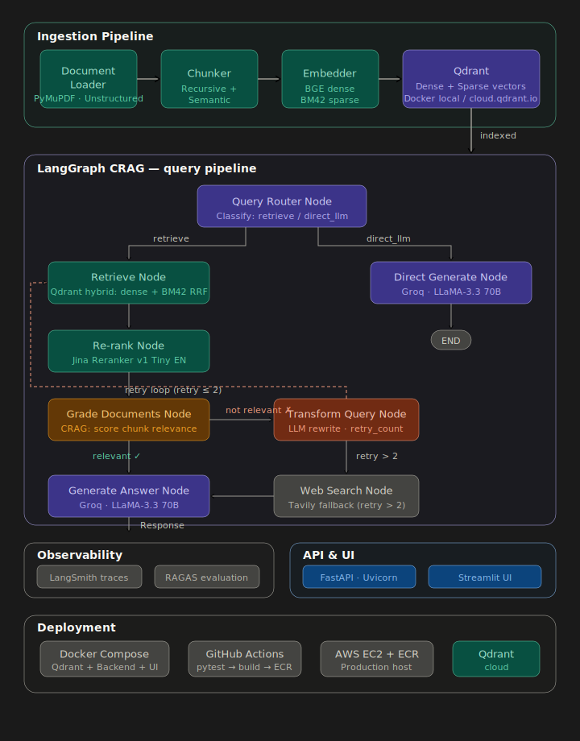

<div align="center">

# 🧠 RAG Document Intelligence Platform

### Production-Grade Adaptive RAG System with Self-Correcting Retrieval

[](https://python.org)
[](https://langchain-ai.github.io/langgraph/)
[](https://qdrant.tech/)
[](https://fastapi.tiangolo.com/)
[](https://groq.com/)
[](https://smith.langchain.com/)
[](https://docker.com/)
[](https://aws.amazon.com/)

<br/>

> Upload any PDF document. Ask questions in natural language.  
> Get grounded, cited answers — powered by hybrid search, cross-encoder re-ranking, and a self-correcting LangGraph pipeline.

<br/>

[Features](#-key-features) · [Architecture](#-system-architecture) · [Tech Stack](#-tech-stack) · [Quick Start](#-quick-start) · [API Reference](#-api-reference) · [Roadmap](#-roadmap)

</div>

---

## 📋 Overview

A production-grade document intelligence system where users upload PDF documents and ask questions in natural language. The system retrieves the most relevant passages using **Qdrant hybrid search** (dense BGE vectors + sparse BM42 vectors with native RRF fusion), re-ranks them using a **cross-encoder**, and generates grounded, cited answers using **Groq LLaMA-3.3-70B** — all orchestrated through a **LangGraph** stateful graph.

Unlike tutorial chatbots, this is a fully observable, evaluated, and containerised inference service with:
- **Hybrid retrieval** combining semantic understanding and keyword matching in a single Qdrant query
- **Cross-encoder re-ranking** for precision over the top-k results
- **LangGraph orchestration** with self-correcting retrieval (Adaptive RAG + CRAG pattern) *(in progress)*
- **Full observability** via LangSmith tracing across every graph node
- **Automated evaluation** using RAGAS metrics *(upcoming)*

---
## High Level Design of the System


---

## ✨ Key Features

| Feature | Status | Description |
|---------|--------|-------------|
| 📄 PDF Document Ingestion | ✅ Implemented | Upload PDFs via API → automatic loading, chunking, and dual-vector indexing |
| 🔍 Hybrid Search (Dense + Sparse) | ✅ Implemented | BGE dense embeddings + BM42 sparse vectors with Qdrant-native RRF fusion |
| 🎯 Cross-Encoder Re-Ranking | ✅ Implemented | Jina reranker re-scores (query, chunk) pairs for precision |
| 🤖 LLM Answer Generation | ✅ Implemented | Groq LLaMA-3.3-70B with strict citation and confidence scoring |
| 🔗 LangGraph Pipeline | ✅ Implemented | Stateful graph: Retrieve → Rerank → Generate with typed state |
| 🌐 FastAPI REST Service | ✅ Implemented | `/ingest` and `/retrieve` endpoints with auto-generated OpenAPI docs |
| 📊 LangSmith Tracing | ✅ Implemented | Full observability with `@traceable` decorators on retrieval and reranking |
| 🔄 CRAG Self-Correction | 🚧 In Progress | Query rewriting, document grading, retry loops, and web search fallback |
| 🌐 Adaptive Query Routing | 🚧 In Progress | Intelligent routing — direct retrieval vs. web search based on query analysis |
| 📈 RAGAS Evaluation | 📅 Planned | Faithfulness, answer relevance, context recall, and context precision scoring |
| 🖥️ Streamlit UI | 📅 Planned | File upload panel, query interface, source viewer, and graph path display |
| 🐳 Docker Compose Stack | 📅 Planned | Qdrant + Backend + Frontend as a single deployable stack |
| 🚀 AWS Deployment | 📅 Planned | CI/CD via GitHub Actions → ECR → EC2 |

---

## 🏗️ System Architecture

```
┌──────────────────────────────────────────────────────────────────┐
│                      INGESTION PIPELINE                          │
│                                                                  │
│  PDF Upload ──► PyMuPDF Loader ──► Recursive Chunker ──► Qdrant  │
│                   (load_pdf)        (500 chars,          (Dual   │
│                                     60 overlap)          Vector) │
│                                        │                         │
│                         BGE Dense Embeddings ──────►┐            │
│                         BM42 Sparse Vectors ───────►├► Qdrant    │
│                                                     │  Collection│
└─────────────────────────────────────────────────────┴────────────┘
                                                   │
                           ┌───────────────────────┘
                           ▼
┌──────────────────────────────────────────────────────────────────┐
│                  LANGGRAPH RAG PIPELINE                          │
│                                                                  │
│   User Query ──► Hybrid Search ──► Cross-Encoder ──► LLM Answer  │
│                  (Qdrant RRF)      Reranking         (Groq)      │
│                  Dense + BM42      Top-3 chunks      LLaMA-3.3   │
│                  Top-10 results                      70B         │
│                                                                  │
│   ┌─────────── UPCOMING: CRAG SELF-CORRECTION ───────────────┐   │
│   │                                                          │   │
│   │  Analyze ──► Retrieve ──► Grade Docs ──► Transform Query │   │
│   │     │             │            │               │         │   │
│   │     │         Generate ◄── Web Search Fallback           │   │
│   │     │             │                                      │   │
│   │  Web Search   Check Answer ──► Response                  │   │
│   │  (fallback)                                              │   │
│   └──────────────────────────────────────────────────────────┘   │
└──────────────────────────────────────────────────────────────────┘
           │              │              │              │
    LangSmith Traces   RAGAS Eval    Qdrant Store   Groq API
```

---

## 🛠️ Tech Stack

| Layer | Technology | Why |
|-------|-----------|-----|
| **Document Loading** | `PyMuPDF` | Fast, reliable PDF text extraction |
| **Text Chunking** | `RecursiveCharacterTextSplitter` | Respects paragraph/sentence boundaries; 500 chars with 60 overlap |
| **Dense Embeddings** | `BAAI/bge-small-en-v1.5` | Free, strong embeddings that run locally — zero API cost at index time |
| **Sparse Embeddings** | `Qdrant/bm42-all-minilm-l6-v2-attentions` | BERT-attention-based sparse vectors; semantically aware keyword matching |
| **Vector Database** | `Qdrant` (Docker local + Cloud) | Supports dense AND sparse vectors in one collection; native RRF hybrid fusion |
| **Hybrid Fusion** | `Qdrant built-in RRF` | Single `query_points()` call with `FusionQuery(RRF)` — no custom fusion code |
| **Re-Ranking** | `Jina Reranker v1 Tiny EN` (via `fastembed`) | Cross-encoder re-scoring for precision over bi-encoder retrieval |
| **LLM** | `Groq LLaMA-3.3-70B` | Free API, blazing-fast inference (500+ tok/sec) |
| **Orchestration** | `LangGraph` | Stateful graph with conditional edges — essential for self-correcting RAG |
| **Observability** | `LangSmith` | Traces every graph node — latency, token usage, I/O, graph path |
| **API** | `FastAPI + Uvicorn` | Async, typed, auto-generated OpenAPI documentation |
| **Evaluation** | `RAGAS` *(planned)* | Faithfulness, answer relevance, context recall, context precision |
| **Containerisation** | `Docker + Docker Compose` *(planned)* | Qdrant + API + UI as a single deployable stack |
| **Cloud** | `AWS (EC2 + ECR + S3)` *(planned)* | Production deployment target with CI/CD |

---

## 📁 Project Structure

```
Advanced-RAG-System/
│
├── src/
│   ├── ingestion/
│   │   ├── loader.py              # PyMuPDF document loader
│   │   ├── chunker.py             # Recursive character text splitter
│   │   └── embedder.py            # Dense BGE + Sparse BM42 → Qdrant dual-vector upsert
│   │
│   ├── retriever/
│   │   ├── hybrid_retriever.py    # Qdrant hybrid search (Prefetch + RRF fusion)
│   │   └── reranker.py            # Cross-encoder re-ranking with Jina reranker
│   │
│   ├── graph/
│   │   └── rag_graph.py           # LangGraph state machine: Retrieve → Rerank → Generate
│   │
│   └── api/
│       ├── main.py                # FastAPI app — mounts ingest & retrieve routers
│       └── router/
│           ├── ingest.py          # POST /ingest — upload, chunk, embed, store
│           └── retrieve.py        # POST /retrieve — invoke LangGraph pipeline
│
├── notebooks/
│   ├── testing_notebook.ipynb     # Experimentation and component testing
│   └── graph_testing.ipynb        # LangGraph pipeline testing
│
├── collections/                   # Qdrant persistent storage (local Docker)
├── data/raw/                      # Uploaded documents storage
├── .env                           # API keys (GROQ, LangSmith, Qdrant, etc.)
├── .dvc/                          # Data version control configuration
├── requirements.txt               # Python dependencies
└── README.md
```

---

## 🚀 Quick Start

### Prerequisites

- Python 3.10+
- Docker (for Qdrant)
- API Keys: [Groq](https://console.groq.com), [LangSmith](https://smith.langchain.com) *(free tiers available)*

### 1. Clone & Setup

```bash
git clone https://github.com/ankitshri00132/Advanced-RAG-System.git
cd Advanced-RAG-System

python -m venv .venv
source .venv/bin/activate        # Linux/Mac
# .venv\Scripts\activate         # Windows

pip install -r requirements.txt
```

### 2. Configure Environment

```bash
cp .env.example .env
```

Add your API keys to `.env`:

```env
GROQ_API_KEY=gsk_your_groq_key
LANGSMITH_TRACING=true
LANGSMITH_API_KEY=lsv2_your_langsmith_key
LANGSMITH_PROJECT=Advanced-RAG-System
QDRANT_API_KEY=your_qdrant_cloud_key        # optional, for cloud deployment
CLUSTER_ENDPOINT=https://your-cluster.cloud.qdrant.io  # optional
```

### 3. Start Qdrant (Docker)

```bash
docker run -p 6333:6333 -v ./collections:/qdrant/storage qdrant/qdrant:latest
```

### 4. Launch the API Server

```bash
uvicorn src.api.main:app --reload --host 0.0.0.0 --port 8000
```

The API is now live at `http://localhost:8000` with interactive docs at `http://localhost:8000/docs`.

---

## 📡 API Reference

### `POST /ingest` — Upload & Index a Document

Upload a PDF file to be processed through the ingestion pipeline (load → chunk → embed → store).

**Request:**
```bash
curl -X POST http://localhost:8000/ingest \
  -F "file=@annual_report_2024.pdf"
```

**Response:**
```json
{
  "status": "success",
  "document_id": "a3f1c2d4-5e6f-7890-abcd-ef1234567890",
  "pages_loaded": 24,
  "chunks_created": 142,
  "message": "Vectors successfully stored in Qdrant DB"
}
```

---

### `POST /retrieve` — Query the Knowledge Base

Ask a natural language question — the LangGraph pipeline retrieves, reranks, and generates a grounded answer.

**Request:**
```bash
curl -X POST http://localhost:8000/retrieve \
  -H "Content-Type: application/json" \
  -d '{"query": "What was the net revenue in Q3?"}'
```

**Response:**
```json
{
  "query": "What was the net revenue in Q3?",
  "answer": "Answer:\nNet revenue in Q3 was $4.2 billion, representing a 12% YoY increase...\n\nCitations:\nannual_report_2024.pdf\nPage 14, Page 15\n\nConfidence:\nHIGH",
  "sources": [
    {
      "rank": 1,
      "rerank_score": 0.94,
      "original_score": 0.87,
      "document": "Q3 net revenue reached $4.2B, a 12% YoY increase...",
      "metadata": {
        "document_id": "a3f1c2d4-...",
        "file_name": "annual_report_2024.pdf",
        "page": 14
      }
    }
  ]
}
```

---

## 🔬 How It Works

### 1. Ingestion Pipeline

```
PDF Upload → PyMuPDF Loader → Recursive Chunker (500 chars, 60 overlap)
                                       │
                   ┌───────────────────┴───────────────────┐
                   │                                       │
           BGE Dense Embedding                    BM42 Sparse Vectors
           (BAAI/bge-small-en-v1.5)    (Qdrant/bm42-all-minilm-l6-v2-attentions)
                   │                                       │
                   └───────────────┬───────────────────────┘
                                   │
                           Qdrant Collection
                        (dual named vector spaces)
```

Each chunk is stored with **both** a dense embedding (for semantic search) and a sparse vector (for keyword matching), along with metadata (document ID, filename, page number, title).

### 2. Hybrid Retrieval + Re-Ranking

```
User Query → Dense + Sparse Encoding → Qdrant Prefetch (10 each)
                                              │
                                     RRF Fusion (built-in)
                                              │
                                     Top-10 Candidates
                                              │
                                  Cross-Encoder Re-Ranking
                                    (Jina Reranker v1)
                                              │
                                       Top-3 Chunks
```

Qdrant's native RRF fusion eliminates the need for custom fusion code. The cross-encoder then re-scores each `(query, chunk)` pair by attending to both together — far more accurate than bi-encoder similarity.

### 3. LangGraph RAG Pipeline (Current)

```
START → retriever_node → reranker_node → answer_node → END
```

The LLM generates a grounded answer with strict citation rules — every response includes:
- **Page numbers** from the source document
- **Source filename** for traceability
- **Confidence level** (HIGH / MEDIUM / LOW)

---

## 🗺️ Roadmap

### ✅ Completed 
- [x] Document ingestion pipeline (PyMuPDF → Chunker → Qdrant)
- [x] Qdrant dual-vector collection (dense BGE + sparse BM42)
- [x] Hybrid search with Qdrant-native RRF fusion
- [x] Cross-encoder re-ranking
- [x] LangGraph RAG pipeline (linear: Retrieve → Rerank → Generate)
- [x] FastAPI REST endpoints (`/ingest`, `/retrieve`)
- [x] LangSmith tracing integration

### 🚧 In Progress
- [ ] CRAG (Corrective RAG) pattern — document grading + query rewriting
- [ ] Adaptive query routing (retrieval vs. web search)
- [ ] Web search fallback via Tavily
- [ ] Retry loops with configurable max attempts
- [ ] Structured output parsing with Pydantic in generate node

### 📅 Upcoming 
- [ ] RAGAS evaluation (faithfulness, answer relevance, context recall)
- [ ] Streamlit UI with file upload, chat interface, and source viewer
- [ ] Graph execution path visualization in UI
- [ ] Docker Compose setup (Qdrant + Backend + Frontend)
- [ ] GitHub Actions CI/CD pipeline
- [ ] AWS EC2 deployment via ECR
- [ ] Qdrant Cloud integration for production vector storage

---

## 🧪 Observability

Every query is traced end-to-end in **LangSmith**, providing:

- 🔍 **Per-node tracing** — input/output for each graph step
- ⏱️ **Latency breakdown** — time spent in retrieval, reranking, and generation
- 💰 **Token usage** — prompt and completion tokens per LLM call
- 🛤️ **Graph execution path** — which nodes were invoked and in what order
- 📊 **RAGAS scores** *(planned)* — quality metrics logged as run-level feedback
